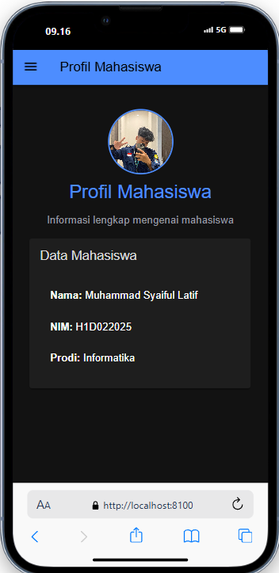
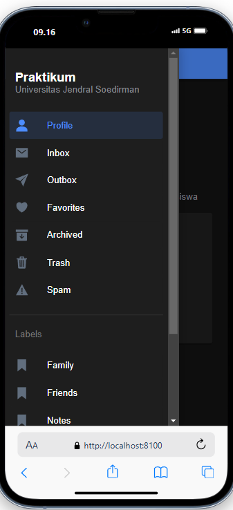

Nama : Muhammad Syaiful Latif
NIM : H1D022025

- membuat halaman baru dengan menjalan kan perintah "ionic generate page myprofile" maka dari perintah tersebut akan mendapatkan folder myprofile yang berisi HTML, SCSS, dan typescript
- import halaman page baru dari page lama pada file typesripct (.ts)
- lalu menambahkan komponen pada halaman html
- Foto profil: ditambahkan <ion-avatar> dengan kelas profile-avatar untuk menampilkan gambar profil. gambar di dalam folder assets dengan nama profile-syaiful.JPG sesuai lokasi gambar yang kita inginkan.
- menambahkan styling pada page css/scss (opsional)
- testing komponen dengan menjalankan perintah "ionic s"